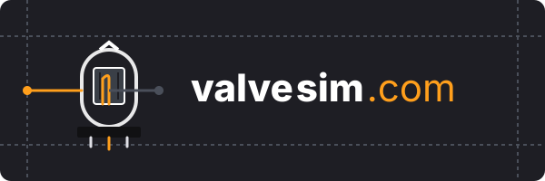

# Valvesim

Interactive **tube amplifier circuit simulator** — design vacuum-tube schematics on an
infinite canvas, wire them up with physics-driven wires, and simulate them with real
Ngspice, all in the browser. Deployed at [valvesim.com](https://valvesim.com).



## Architecture

| Layer | Technology |
| --- | --- |
| Frontend engine | [PixiJS v8](https://pixijs.com) (WebGPU → WebGL fallback) + [`@pixi-essentials/svg`](https://www.npmjs.com/package/@pixi-essentials/svg) for vector symbol parsing, on Vite + React + TypeScript |
| Physics layer | [Verly.js](https://github.com/anuraghazra/Verly.js) — Verlet integration for dynamic wire drape / mouse handling (**git dependency**, not published to npm) |
| Simulation core | [`eecircuit-engine`](https://www.npmjs.com/package/eecircuit-engine) — Ngspice compiled to WebAssembly, executed in a native `Web Worker` |
| Backend | Node.js + [Fastify](https://fastify.dev) (low-latency JSON) |
| Database | PostgreSQL 16+ — schematics as JSONB, relational component inventory |

### Repository layout

```
/valvesim
├── /app                     # Frontend client (Vite + React + TS)
│   ├── /public              # Static assets (logo, SVG component icons)
│   └── /src
│       ├── /components      # UI overlays, sliders, sidebar panels
│       ├── /engine          # PixiJS canvas pipeline
│       │   ├── Viewport.ts  # Pan, zoom, and grid system
│       │   ├── Component.ts # Base interactive schematic symbol class
│       │   └── Wire.ts      # Verlet-integrated dynamic wire logic
│       ├── /simulation      # SPICE WebAssembly layer
│       │   ├── netlist.ts   # Schematic model -> SPICE netlist text
│       │   └── spice.worker.ts # Background thread running eecircuit-engine
│       ├── App.tsx          # Layout bootstrap
│       └── main.tsx
│
├── /api                     # Backend server (Node.js + Fastify)
│   └── /src
│       ├── /config          # Database connection & pooling
│       ├── /controllers     # Business logic (save/load, model lookup)
│       ├── /models          # PostgreSQL schema + migration runner
│       ├── /routes          # /api/designs, /api/components
│       └── server.ts        # Service entry point
│
├── package.json             # npm workspaces (app + api)
└── README.md
```

## Getting started

Requires **Node.js ≥ 22** and (for persistence) **PostgreSQL ≥ 16**.

```bash
npm install

# Frontend — http://localhost:5173
npm run dev

# Backend — http://localhost:3001 (proxied at /api by the Vite dev server)
npm run dev:api
```

The API boots without a database (`GET /health` reports `db: down`); to enable
save/load, create a database and apply the schema:

```bash
createdb valvesim
cp api/.env.example api/.env   # then edit credentials
npm run migrate
```

### Production builds

```bash
npm run build        # builds app (vite) and api (tsc -> api/dist)
npm run start:api    # node api/dist/server.js
```

## Theme — "Retro Filament Glow"

Warm dark mode inspired by vintage tube amps and glowing filaments
(defined as CSS variables in [app/src/theme.css](app/src/theme.css)):

| Role | Color |
| --- | --- |
| Background | `#1E1E24` Deep Charcoal Black |
| Grid lines | `#2D2D35` Muted Gunmetal |
| Active elements / wires | `#FF9F1C` Amber / Filament Glow |
| UI accents | `#EAF2EF` Off-White Cream |

## Component design language

The palette is intentionally empty. Components will be authored as **flat 2D SVG
illustrations with labeled pins**, in the style of the reference sheets for the
Hammond 372HX power transformer and the 5U4G rectifier tube:

- bottom/pin-view symbol with numbered terminals,
- every pin labeled with its electrical role (`PLATE_1`, `HEATER+`, `HV Start`…),
- and an explicit **pin → SPICE net mapping** (e.g. 5U4G pin 4 → `PLATE_1` → net `HV_P1`),
  which is exactly what `engine/Component.ts` (the `Pin` interface) and the
  `components` DB table (`pin_map`, `spice_model`) are shaped around.

## Implementation notes

- **Verly.js** isn't on npm — it's pulled from GitHub (`verlyjs`). Its modules expect a
  global `Vector` (its own bundle sets `window.Vector`), so `engine/Wire.ts` imports the
  physics primitives directly and installs that global before use.
- The spec name `@pixi/essentials-svg` resolves to the actual package
  **`@pixi-essentials/svg`** (v3 targets PixiJS v8).
- The SPICE worker lazy-loads the Ngspice WASM engine on first run; a built-in RC
  low-pass smoke-test netlist (`simulation/netlist.ts`) verifies the round-trip from
  the **Run Simulation** button.
